<!--

author: Swantje Piotrowski, Gregor Große-Bölting
email:  ggb@informatik.uni-kiel.de
version: 0.1
language: en
narrator: UK English Female

-->

# Projektseminar zur Geschichte der Neuzeit: Frauengeschichte(n) in der Frühen Neuzeit digital erschließen.

**Dozierende:**

* Dr. Swantje Piotrowski, M.A.
* Dr. Gregor Große-Bölting, M.A., M.A.

**Zeit und Raum:** Do 10:15 - 11:45, Raum LS 11-R. 109

**Inhalt:**

Über das Leben und Wirken von Frauen im öffentlichen Raum im 17. und 18. Jahrhundert ist wenig bekannt. Im Gegensatz zu den Männern hinterließen sie nur selten Spuren in historischen Überlieferungen. Im Universitäts- und Landesarchiv in Schleswig befinden sich jedoch Quellen, die bislang in Hinblick auf Frauen- und Geschlechterforschung noch nicht ausgewertet wurden. In dieser forschungsorientierten Lehrveranstaltung sammeln, strukturieren und interpretieren Studierende Informationen aus historischen Quellen (z.B. Frauenbiographien), um Einblicke in soziale und familiäre Netzwerke, in karikative Tätigkeiten und den Bildungsstand von Frauen in der Frühen Neuzeit zu erhalten. Die Lehrveranstaltung hat das Format einer (digitalen) Forschungswerkstatt: Der Arbeitsablauf wird Schritt für Schritt entwickelt, umgesetzt und diskutiert. Durch die Forschungspraxis werden Studierende mit digitalen Grundkenntnissen sowie mit gängigen Methoden für die digitale Bearbeitung und Auswertung von handschriftlichen Quellen vertraut gemacht. Die Lehrveranstaltung bildet so eine solide Grundlage für die kritische Anwendung solcher Verfahren im weiteren Studium und in wissensvermittelnden Berufsfeldern. Als Prüfungsleistung gilt die Erstellung eines Reflexionsberichts über den Arbeits- und Forschungsprozess sowie die Visualisierung der Rechercheleistung.

**Lernziele:**

* Transkription von handschriftlichen und gedruckten Dokumenten
* fachwissenschaftliche Einordnung der Quellen
* vertiefte fachwissenschaftliche Kenntnisse (Frauen- und Geschlechtergeschichte, Biographiegeschichte, Public History, Sammlungsgeschichte)
* Methodenkompetenz im Bereich der Digital Humanities
* Visualisierung und Präsentation der Forschungsergebnisse
* Erfahrungen in den Berufs- und Praxisfeldern Wissensvermittlung
* eigenständiges und selbstorganisiertes Arbeiten

**Weiterführende Links und Literatur:**

* Artikel zur Geschlchtergeschichte: https://docupedia.de/zg/Geschlechtergeschichte
* Link zum **DDF:** https://www.digitales-deutsches-frauenarchiv.de
* Link zum **akhfg:** https://akhfg.de
* Link zum **Center for the History of Women Philosophers and Scientists**: https://historyofwomenphilosophers.org/

## Allgemeines und erste Sitzung

### Semesterplan

**Termine:**

| Datum | Thema/Inhalt |
|-------|--------------|
| 18.04. | Begrüßung, Organisatorisches, Erwartungen, Fragen |
| 25.04. | Inhaltliche Einführung in den Themenbereich "Frauen- und Geschlechtergeschichte" |
| 02.05. | Frühe Neuzeit als Epoche / Anfänge und Entwicklungen der Geschlechtergeschichte / Potentiale und Kritik / Diskussion von potenziellen Forschungsthemen |
| 09.05. | Feiertag CHRISTI HIMMELFAHRT |
| 16.05. | Einführung in verschiedene Quellenarten zur Erforschung von Frauenbiographien / Arbeit mit ungedruckten Quellen und Handschriften / Transkribus /  Archivinformationssystem Arcinsys |
| 23.05. | Digitaliserung von Quellen, Arbeit mit Digitalisaten und Forschungsdaten (m. B. Petersen) |
| 30.05. | Besuch im Landesarchiv (mit dem Leiter des Universitätarchivs Dr. Jörg Rathjen) |
| 06.06. | gemeinsame Arbeitssitzung / Analyse der gesammelten Quellen/ |
| 13.06. | Entwicklung von Forschungsfragen / Beispiele für Online-Präsentationen / Präsentation der Quellen |
| 20.06. | Metadatenstandards: Welche gibt es und ihr Sinn und Zweck / Anwendung auf Forschungsergebnisse |
| 27.06. | Omeka S und "How to" zur Präsentation der Quellen |
| 04.07. | gemeinsame Arbeitssitzung / Recherche / Feedback und Beratung zur Weiterentwicklung der Forschungsprojekte |
| 11.07. | Präsentation der (Zwischen-)Ergebnisse, Evaluation |

#### ScanTent

#### Transkribus

#### Omeka

### Prüfungsleistung

Produkt zur Darstellung der ausgewählten Quellen inkl. Reflexion zur frauengeschichtlichen Bedeutung.

Details folgen im Laufe des Semesters.

### "Regierungserklärung"

1. Diese Veranstaltung ist eine Forschungswerkstatt: Wir setzen neue Methoden und Software ein. Seien Sie also nachsichtig mit uns und mit sich selbst, wenn mal etwas nicht funktioniert wie geplant. Lassen Sie uns zeitnah wissen, wenn Sie Probleme haben, dann findet sich für alles eine Lösung!
2. Weil es sich um eine Forschungswerkstatt handelt, erwarten wir Eigenengagement und Eigeninitiative für das Thema: Sie werden an verschiedenen Stellen selbst recherchieren, arbeiten und experementieren müssen. Im Gegenzug unterstützen wir Sie, wo wir können.
3. Es kann sein, dass Sie in Ihren Quellen wenig oder gar keine biographischen Details finden: Das ist auch ein Ergebnis, dessen Dokumentation einen Wert hat!
4. Der Seminarplan ist "im Fluss".

### Gruppenarbeit Mind-Map

1. Bilden Sie Gruppen von 3 bis 4 Teilnhemenden.
2. Jede Gruppe wählt ein Hauptthema aus dem Bereich der Frauen- und Geschlechterforschung in der Frühen Neuzeit, z.B. Frauen in der Wissenschaft, Frauen und Religion, Frauen und Bildung, etc.
3. Erstelln Sie eine Mind-Map: Diese sollte die folgende Elemente enthalten:

   * Hauptthema (z.B. Frauen in der Wissenschaft)
   * Unterkategorien oder Aspekte des Themas (z.B. berühmte Wissenschaftlerinnen, Zugang von Frauen zur Bildung, Herausforderungen für Frauen in der akademischen Welt, etc.)
   * Schlüsselbegriffe, Personen, Ereignisse oder Quellen, die mit den Unterkategorien verbunden sind
   * Präsentation: Jede Gruppe präsentiert ihre interaktive Mind-Map und erläutert kurz die ausgewählten Themen.

### Aufgabe zur nächsten Woche

Bitte lesen Sie zur nächsten Woche den folgenden Artikel:

* Leonie Schöler: Beklaute Frauen: Denkerinnen, Forscherinnen, Pionierinnen: Die unsichtbaren Heldinnen der Geschichte. München 2024, Einleitung, S. 11-23 (im Olat-Ordner).

Desweiteren können Sie optional und zur weiteren Vertiefung den folgenden Artikel lesen:

* [Kirsten Heinsohn](https://docupedia.de/zg/Docupedia:Kirsten_Heinsohn "Docupedia:Kirsten Heinsohn"), [Claudia Kemper](https://docupedia.de/zg/Docupedia:Claudia_Kemper "Docupedia:Claudia Kemper"), Geschlechtergeschichte, in: Docupedia-Zeitgeschichte, 04.12.2012, [http://docupedia.de/zg/heinsohn_kemper_geschlechtergeschichte_v1_de_2012](https://docupedia.de/zg/Docupedia:Kirsten_Heinsohn)

## Sitzung am 25.04.2024

### Gruppenarbeit Mind-Map

1. Bilden Sie Gruppen von 3 bis 4 Teilnehmenden.
2. Jede Gruppe wählt ein Hauptthema aus dem Bereich der Frauen- und Geschlechterforschung, z.B. Frauen in der Wissenschaft, Frauen und Religion, Frauen und Bildung, etc.
3. Erstellen Sie eine Mind-Map. Diese sollte die folgende Elemente enthalten:

   * Hauptthema (z.B. Frauen in der Wissenschaft)
   * Unterkategorien oder Aspekte des Themas (z.B. berühmte Wissenschaftlerinnen, Zugang von Frauen zur Bildung, Herausforderungen für Frauen in der akademischen Welt, etc.)
   * Schlüsselbegriffe, Personen, Ereignisse oder Quellen, die mit den Unterkategorien verbunden sind

4. Jede Gruppe präsentiert ihre Mind-Map und erläutert kurz die ausgewählten Themen.

#### Ergebnisse: Gruppe "Bildung"

#### Ergebnisse: Gruppe "Macht"

#### Ergebnisse: Gruppe "Religion"

#### Ergebnisse: Gruppe "Wissenschaft"

#### Ergebnisse: Gruppe "Politik"

### Aktuelle Debatten um Stereotypen

> Sind diese Geschlechterstereotype aktuell überwunden? Was meinen Sie?

{{1}}
> _Die bereits erwähnten Stereotypen und bestehenden Vorurteile gegenüber Frauen sind weiterhin präsent, wie eine aktuelle Untersuchung zur "Darstellung von Geschlechterrollen in sozialen Medien und deren Einfluss auf die Geschlechtergerechtigkeit" verdeutlicht:_

{{2}}

{{3}}
********

Quelle: [https://www.plan.de/rollenbilder-in-social-media.html?sc=IDQ24200](https://www.plan.de/rollenbilder-in-social-media.html?sc=IDQ24200)
********

### Aufgabe zur nächsten Woche

Bitte lesen Sie zur nächsten Woche den folgende Artikel:

* Geschlechterrollen in der Frühen Neuzeit: https://referenceworks.brill.com/display/entries/EDNO/COM-272465.xml

* Epochenbegriff Frühe Neuzeit: https://referenceworks.brill.com/display/entries/EDNO/COM-267907.xml#d39764389e786

* Natalie Zemon Davis, Neue Perspektiven für die Geschlechterforschung in der Frühen Neuzeit; im Olat-Ordner

## Sitzung am 02.05.2024

### Leichenpredigt Katharina Franck (1698)

Die vollständige Leichenpredigt finden Sie im OLAT.

**Titel:** Das Testament und letzter Wille des sterbenden Jesu

**Untertitel:** Bey Christlicher Leichbestattung Der Weiland Hoch Edlen Groß Ehr- und Hochtugendreichen Frauen Frauen
Catharina gebohrnen Clausen Des Magnifici, HochEhrwürdigen/ HochEdlen und Hochgelahrten Herrn Christophori Francken
SS. Theol. Doctoris, fürnehmsten Professoris und hochansehnlichen Procancellarii dieser hochlöblichen Universität
hertzgeliebten Hauß-Ehre In damahliger Leichen-Predigt aus Joh. XVII, v. 24. (Vater Ich will/ daß wo Ich bin etc.) Am Sontage
Oculi, war der 27. Martii dieses itztlauffenden 1698sten Jahrs in der Haupt-Kirchen St. Nicolai im Kiel in Volckreicher
Versamlung eröffnet.

#### Personalia

Finden Sie an der Leichenpredigt etwas überraschend? Wenn ja was?

{{1}}
> * ganz allgemein: die Tatsache, dass für eine Frau der Frühen Neuzeit eine Leichenpredigt verfasst wurde
> * der Sprachgebrauch (herzliche, teilweise liebevolle Begriffe und Äußerungen)
> * Beispiel: "welche mit Raht und That ihm aufs freundschaftlischste und holdseligste an die Hand gegangen."
> * ein Sprachgebrauch, der sich quasi auf "Augenhöhe" mit den Leichenpredigten, die für Männer geschrieben wurden, befindet
> * ausführlich wird auf die soziale Herkunft und den Stand von Katharina Franck verwiesen
> * ihre Zugehörigkeit zum gehobenen Bürgertum Kiels scheint den Stellenwert ihres Geschlechts abzulösen 

#### Frauengeschichtliche Interpretation

Welche Textstellen aus dem Abschnitt zu den "Personalia" würden Sie als Beschreibung typisch weiblicher Merkmale kennzeichnen?

{{1}}
********
**Quellenauszüge:**

> * ganz liebreiche, vernünftige und tugendhafte Eheliebste (Rolle der Ehefrau)
> * die Haushaltung, deren Last sie ihm gänzlich abgenommen (Rolle der Hausfrau)
> * daß an und für ihr erfüllet worden, was sonst von einer guten Ehefrauen in seinen weisen Sprüchen Salomo schreibt: Ihres Mannes Herz darf sich auf sie verlassen (die treue Hausfrau)
> * auch müssen ihre Söhne sie als eine brünstig liebende, wahre, getreue Mutter preissen (die Rolle der Mutter)

> _Die Zuschreibung als Mutter, Hausfrau und Ehefrau verweist die Frau auf die private Sphäre des Hauses (Privatheit), während die öffentliche Sphäre, Politik und Berufswelt, den Männern zugeordnet wurde (Öffentlichkeit)_
********

### Aufgabe zur nächsten Woche

1. Melden Sie sich beim [Archivinformationssystem Schleswig-Holstein](https://arcinsys.schleswig-holstein.de) an und machen Sie sich mit der Suche und der Struktur der Gliederung der Akten vertraut.
2. Versuchen Sie sich an der Transkription der folgenden Handschriftseite aus einem Zauberey-Prozess:

## Sitzung am 09.05.

Entfällt wg. Feiertag!

## Sitzung am 16.05.

### Transkription der Handschrift zur Hexenverfolgung

Landesarchiv Schleswig-Holstein Abt. 7/Nr. 1758 und Amtsrechnung 106/ Bordesholm (1638-39)

#### Transkription

>WolEdle Gestrenge Ehr[?]este GroßAchtbare 
>
>und hochgelarte großgünstige hochgeehrte liebe herrn 
>
>D. herlick: und hochgel. gst. kan ich hiemit und 
>
>dienstlich nicht bergen, Waßgestaldt mir dieses 
>
>Ambts underthan Carsten Resen zue Wackenbegke 
>
>wehemütiglich geklaget, daß seine Haußfraue 
>
>nun eine geraume zeithero betlegerig gewesen, 
>
>und in ihren gliedern große schmertzen empfunden, 
>
>Welcheß wie er und seine Haußfraue vormeinen
>
>ihr von einem alten Weibe in selbigem dorffe 
>
>Anneke Drewes geheißen angethan und veruhr-
>
>sachet wurde, dan wie gemelte seine fraue für 
>
>ungefehr 2 Jahren mit gemelter Dreweschen in 
>
>streith und wordtgezangk gerathen, und seine fraue
>
>dero Zeit schwanger gewesen, wehre die Drewesche 
>
>mit diesen Worten gegen ihr herauß gefahren: 
>
>Hörstu de Gehall mit deme du im geist, 
>
>wehe und bange werden, darauff sie dan als [forth] unge- 
>
>sundt geworden, seid dehme keinen guten tagk
>
>gehabet und wehre daß Kindt wie eß zur
>
>weldt kommen, fast an allen gliedern vorlähmet
>
>gewesen ist hette sich auch unterm bette dar-
>
>auff daß Kindt mit der Mutter gelegen des Nachts
>
>sich ein gespenst erreüget, welcheß die bette steite 
>
>Carsten Rese. c/a Anneke Drewes 
>
>8/12 1638

#### Kontext des Quellenabschnitts

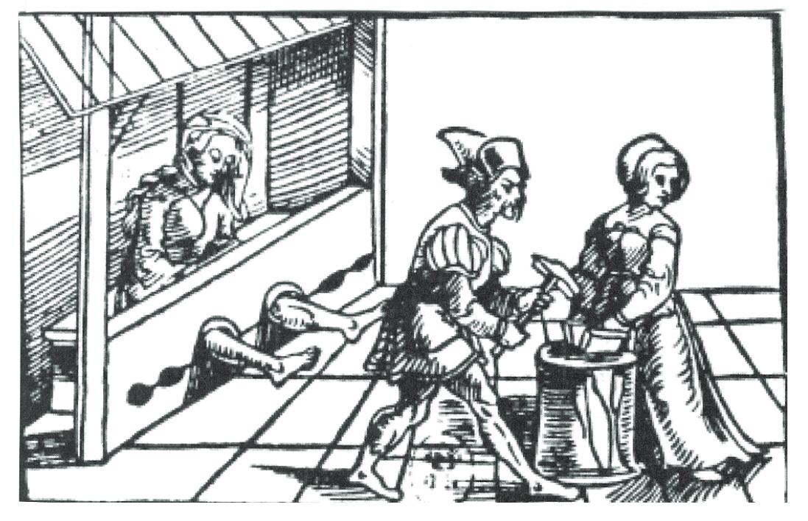

1638 wurde Anneke Drewes von ihrem Nachbarn und dessen Frau nach einem Streit angeklagt wegen
Hexerei, Kindsmord (Bezauberung einer Schwangeren und Tod des Kindes nach eineinhalb Jahren!) und
Viehseuche. Herzog Friedrich III erlaubte auf Anfrage Folterung. Aber Anneke Drewes gestand nicht. Man
ließ sie aber nicht frei, sondern sperrte sie 56 Tage im Gefängnis ein. Währenddessen verlangten „sämtliche
Eingesessenen des Dorfes“ Wattenbek einen erneuten Einsatz von Folter. Der Bordesholmer Amtsschreiber
Pund verfasste den Antrag an den Herzog und dieser gab nach, erlaubte aber nur die territio verbalis, die
Schreckung, wobei man der Angeklagten, also Anneke Drewes, die Folterinstrumente zeigte, um ein
Geständnis zu erzwingen. Das Opfer musste dabei annehmen, dass es wieder schreckliche Qualen
auszuhalten hatte. Aber Anneke gestand wieder nicht und wurde freigelassen. Ob die Freilassung in diesem
Fall durch den Fürst direkt oder eine fürstliche Anweisung an das Holstengericht geschah, ist den Akten
nicht genau zu entnehmen.

#### Quellenbeispiel mit Transkribus 

### Automatische Transkription mit Transkribus

Transkribus ist ein Transkriptions-Tool, das von der Read COOP entwickelt wurde und Forschern und Wissenschaftlern dabei hilft, handschriftliche Dokumente zu digitalisieren und zu analysieren. Das Tool basiert auf der optischen Zeichenerkennung (OCR) und maschinellem Lernen und kann sowohl gedruckte als auch handgeschriebene Texte automatisch transkribieren. Darüber hinaus ermöglicht Transkribus auch die manuelle Transkription durch menschliche Transkribenten, wobei das Tool sie bei der Organisation und Verwaltung der Transkription unterstützt.

Das Tool ist besonders nützlich für historische Dokumente, Archive, Bibliotheken und Museen, die ihre Dokumente digitalisieren und archivieren möchten. Transkribus bietet auch verschiedene Analysewerkzeuge an, die es Forschern erleichtern, die Inhalte und Strukturen der transkribierten Texte zu untersuchen.

#### Die Benutzeroberfläche

Die nachfolgenden Screenshots sind nicht mehr ganz aktuell, zeigen aber strukturell immer noch gut, was wo zu finden ist.

##### Workdesk

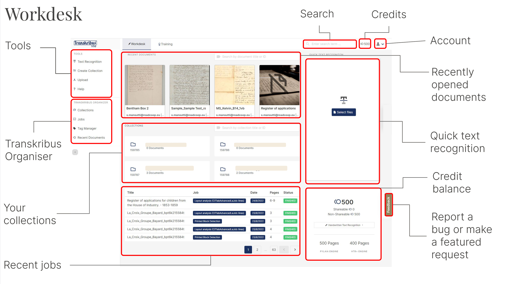

##### Collections - View

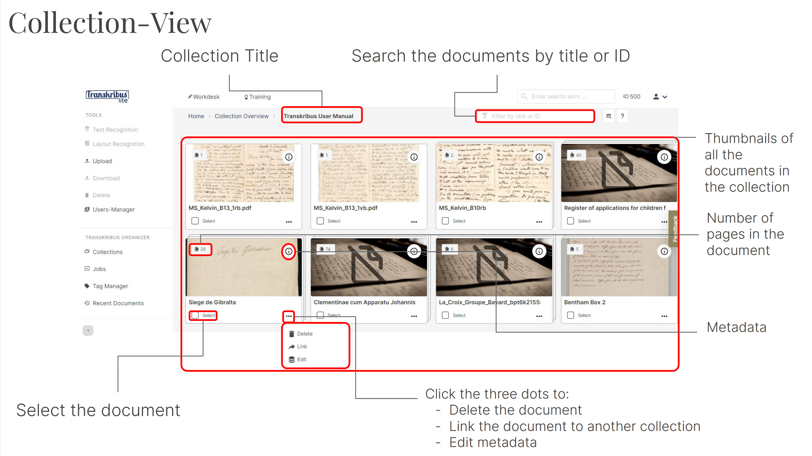

##### Collections - Organizer

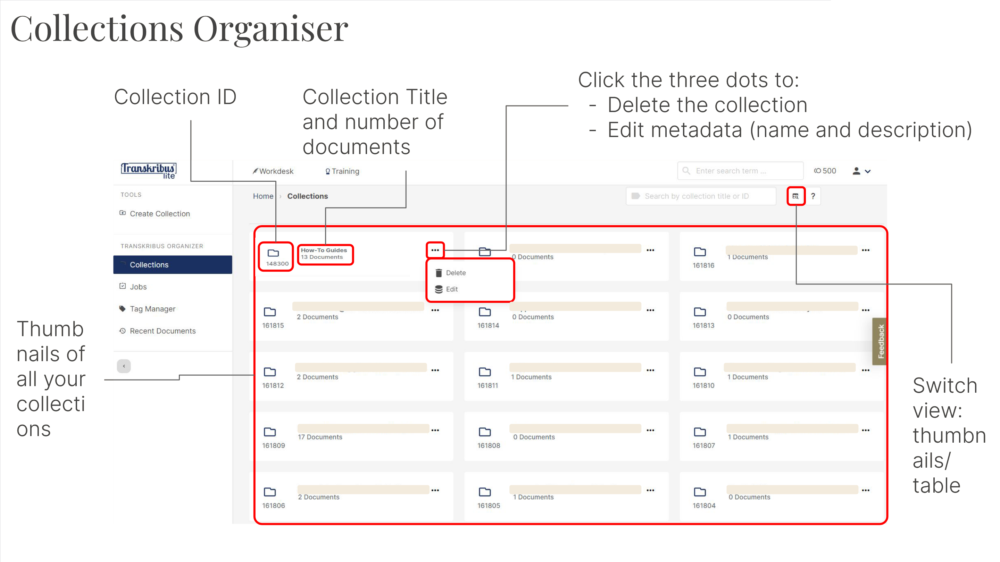

##### Document - View

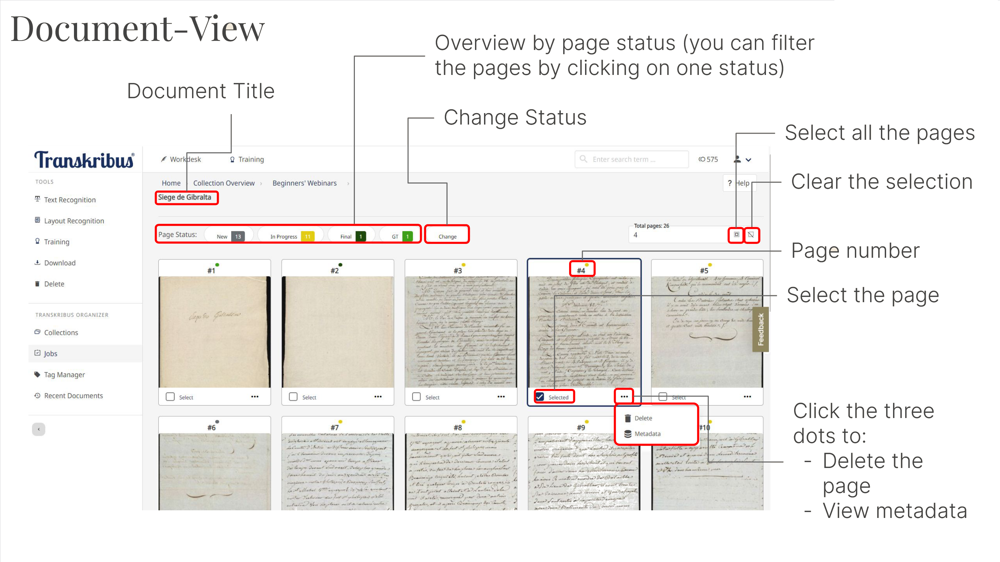

##### Editor - Elements

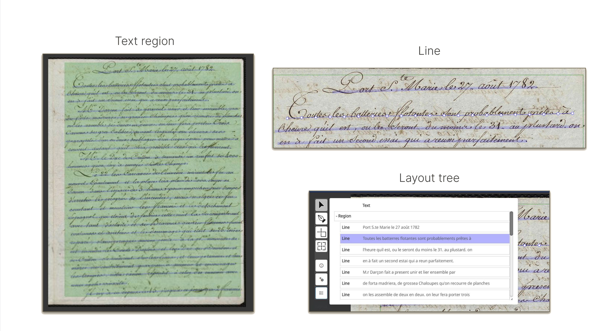

##### Editor - Layout and Text 1

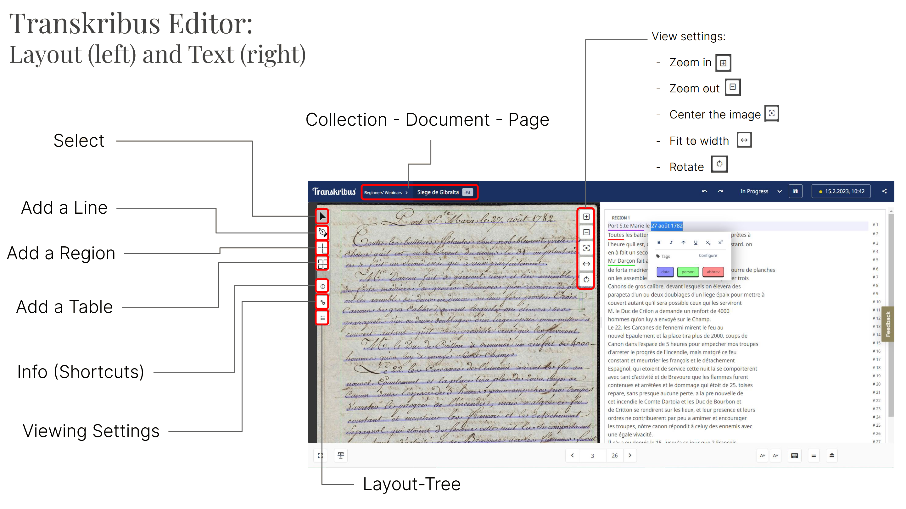

##### Editor - Layout and Text 2

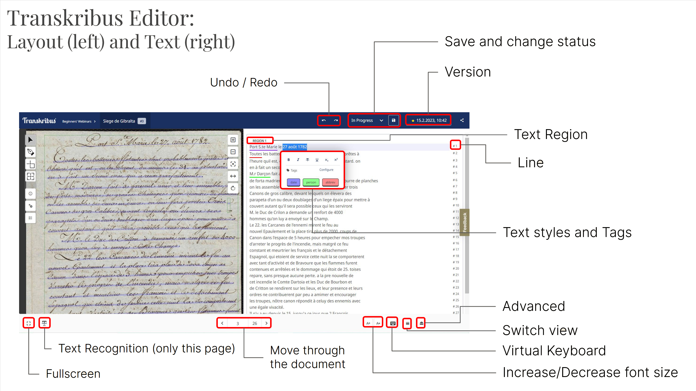

##### Tools Organizer

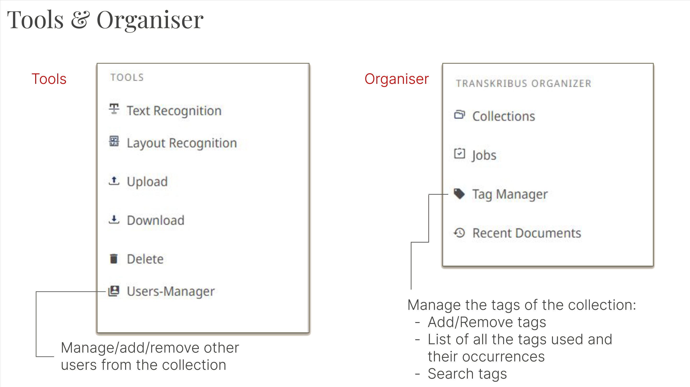

#### Der Workflow

1. Account anlegen
2. Collection mit einem sinnvollen Namen erstellen
3. PDF Dokument hochladen: Entweder in der Collection oder unter Upload die Datei auswählen; aufpassen, dass der korrekte Dateityp gewählt wird.
4. Automatische Texterkennung starten:

   * Modelauswahl: *The Text Titan I* (erfordert Premium-Account) oder *The German Giant I* für Handschriften, *Transkribus Print M1* für Print verwenden.
   * Warten: Die Transkription kann einige Zeit in Anspruch nehmen. Einen Überblick über den Fortschritt kann man sich unter "Jobs" verschaffen.

5. Für jede Seite...

   * Layout überprüfen und anpassen: Stimmen die Regionen oder sollten Regionen zusammengelegt werden? Wurden alle Zeilen erfasst? Wurden die Marginalien erfasst?
   * Transkription überprüfen: Erkennungsfehler beheben.
   * Speichern.

6. Export der Ergebnisse

### Aufgabe zur (über)nächsten Woche (d. h. spätestens 30.05.)

>Machen Sie sich mit Arcinsys vertraut. Entscheiden Sie sich für ein Themenfeld, das Sie interessiert und über das Sie weiter recherchieren möchten. Dazu können Sie sich an den Ergebnissen der Gruppenarbeit vom 25.04. orientieren (s. im Material oben).
>
>Ermitteln Sie für das Thema mögliche Quellen im Landesarchiv und notieren Sie sich die Signaturen bzw. bestellen Sie die Akte. 

## Sitzung am 23.05.

Besuch von Britta Petersen (RZ)

## Sitzung am 30.05.

Gemeinsamer Ausflug in das Landes- und Universitätsarchiv Schleswig-Holstein

## Sitzung am 06.06.

### Blitzlicht: Reflexion Landesarchiv

1. Wie war es?
2. Was haben Sie mitgenommen?
3. Sind Sie auf eine interessante/vielversprechende Quelle gestoßen?

### Dokumentation

Notieren Sie sich möglichst zeitnah... 

* Wann wurden die Digitalisate erstellt?
* Wonach (Thema, Themenbereich, konkrete Suchbegriffe, Signaturen) wurde gesucht?
* Gab es Gründe, warum Sie bestimmte Texte mitgenommen haben?
* Wie wurden die Digitalisate erstellt?
* Was wissen Sie über beteiligte Personen, bspw. die Autor:innen?
* Was ist noch wichtig?

### Mögliche Probleme bei der Arbeit mit Transkribus

#### Quellenmaterial

{{1}}
**Q:** Was mache ich, wenn meine Transkription so aussieht?
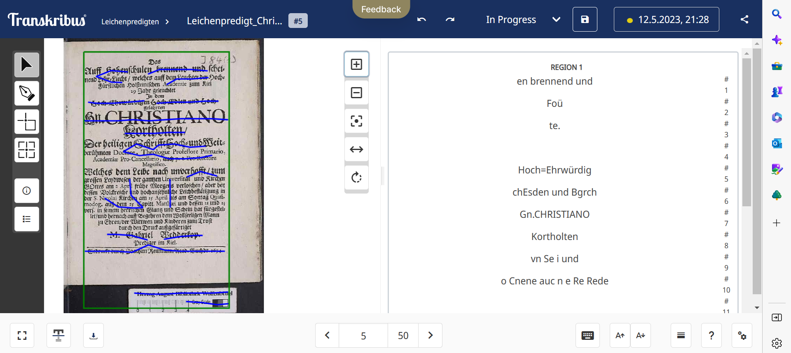

{{2}}
**A:** Bei einer Transkription, bei der die Linien in diesem Ausmaß falsch erkannt werden, liegt das Quellenmaterial vermutlich in zu geringer Auflösung vor. Dies kann insbesondere dann vorkommen, wenn es sich um ein automatisch generiertes PDF-Dokument handelt. Wenden Sie sich in diesem Fall bitte an uns!

{{3}}
**Q:** Was mache ich, wenn überflüssige Informationen (bspw. Anmerkungen von Bibliotheken) mittranskribiert werden?

{{4}}
**A:** Diese Informationen *sollen* restlos gelöscht werden. Die Regionen sollten so angepasst werden, dass sie den entsprechenden Bereich nicht miterfassen.

#### Linien

{{1}}
**Q:** Wie können neue Zeilen (bspw. für Bibelverse) angelegt werden?

{{2}}
**A:** Mit dem Linientool, s. Demo!

{{3}}
**Q:** Wie ist mit getrennten Linien (Zeilen) umzugehen?

{{4}}
**A:** Leider gibt es derzeit keine andere Lösung, als die Inhalte der zweiten Hälfte in die erste zu kopieren und dann das überflüssige Fragment zu entfernen.

{{5}}
**Q:** Wie lassen sich Linien trennen?

{{6}}
**A:** Auch dafür gibt es keine elegante Lösung: Mit dem Linientool sollten für die neuen Elemente Linien gezogen und die Inhalte hinein kopiert werden. Die ursprüngliche Linie kann dann entfernt werden.

#### Regionen

{{1}}
**Q:** Wie können zusätzliche Angaben (wie Bibelstellen) einer Extraregion zugeordnet und trotzdem erkennbar gemacht werden, in welcher Zeile sie ursprünglich standen?

{{2}}
**A:** Das ist möglich, aber für unsere Zwecke nicht notwendig. Implizit wird es bereits miterfasst.

{{3}}
**Q:** Kann ich die Größe/Form von Regionen verlässlich (sprich: nicht mit der Maus) ändern?

{{4}}
**A:** Nein. Leider stellt die Maus derzeit die einzige Möglichkeit der Bearbeitung dar.

{{5}}
**Q:** Wofür müssen neue Regionen angelegt werden bzw. wofür sind einzelne Regionen sinnvoll?

{{6}}
**A:** *So viele wie nötig, so wenig wie möglich.* Für den Fließtext einer Seite sollte eine Region angelegt werden, darüber hinaus für die Marginalia und (falls vorhanden) die Fußnoten. In der Regel sollten Sie mit zwei bis drei Regionen pro Seite auskommen.

#### Transkription

**Q:** Wie mit handschriftlichen Ergänzungen umgegangen werden? Wie verlässlich müssen die transkribiert werden?

{{1}}
**A:** Das kommt ganz darauf an...

{{2}}
**Q:** Wie können große, verzierte Buchstaben transkribiert und zugeordnet werden?

{{3}}
**A:** Transkribus erkennt solche Buchstaben häufig gar nicht; sie sind im Transkript manuell an der korrekten Stelle zu ergänzen.

{{4}}
**Q:** Sind vermutete Leerzeichen in der Transkription zu ergänzen, wenn sie im Original nicht ersichtlich sind?

{{5}}
**A:** Nein.

{{6}}
**Q:** Woran liegt es, dass teils unterschiedlich viele Buchstaben groß/klein geschrieben werden? Muss die Groß- und Kleinschreibung korrigiert werden?

{{7}}
**A:** Die Groß- und Kleinschreibung sollte der Quelle entsprechen.

#### Wie geht es weiter?

**Q:** Gibt es weitere Fragen?

{{1}}
**A:** ...

{{2}}
**Q:** Sollen in Transkribus Annotationen gemacht werden?

{{3}}
**A:** Nein. Das ist zwar möglich, aber wir werden die Annotationen in einem zweiten Schritt (und sehr viel bequemer) angehen.

{{4}}
**Q:** Wenn wir damit fertig sind, wie sollen wir Ihnen das schicken?

{{5}}
**A:** Über den Export sprechen wir in der kommenden Woche.

### Absprachen für die Transkription

* Die Transkription erfolgt quellennah, Eingriffe sollten soweit möglich vermieden werden. 
* Leerzeichen bleiben erhalten, wie sie in der Quelle erkennbar sind.
* Eingriffe in den Text (bspw. weil etwas nicht lesbar, unverständlich oder ergänzt worden ist) werden (zunächst!) durch eckige Klammern "[", "]" kenntlich gemacht. 

### Zur nächsten Woche

Wählen Sie einen Text(ausschnitt) aus, den Sie weiter bearbeiten möchten. 

Transkribieren Sie den gewählten Text(ausschnitt) soweit Sie kommen. Erstellen Sie eine Dokumentation (s. o.).

## Sitzung am 13.06. 

### Inkshedding: Themenfindung

1. Falten Sie ein DIN A4-Blatt vertikal in der Mitte. Vervollständigen Sie auf der linken Seite des Knicks den nachfolgenden Satz. Nutzen Sie die komplette linke Seite und schreiben Sie möglichst leserlich! Sie haben 10 Minuten Zeit.

> An meiner Quelle interessiert mich besonders, dass ... In die Frauengeschichte würde ich die Quelle so einordnen ... 

2. Anschließend werden alle Zettel eingesammelt, gemischt und erneut ausgeteilt. Lesen Sie den (hoffentlich fremden) Text, markieren und kommentieren Sie die Punkte, die Ihnen besonders gut gefallen und spannend sind. Achten Sie auf interessante Inhalte und kommentieren Sie bitte immer positiv, etwa so: „Großartige Idee! Dazu fällt mir auch ein, dass …“. Dazu stehen 5 bis 10 Minuten zur Verfügung.
3. Wir wiederholen 2. ein zweites Mal.

### Zur nächsten Woche

Bereiten Sie zwei Texte von Johanna Drucker vor, die sich mit Daten und Metadaten beschäftigen. Insbesondere die Teile 2a und 4a sind für uns relevant. Die Texte finden Sie im Materialverzeichnis unter der kommenden Sitzung.

## Sitzung am 20.06.

### Zur nächsten Woche

Sichten Sie die Erfassungsstandards für Metadaten des METAscript-Projekts: https://metascripta.org/standards

Bewerten und entscheiden Sie, welche Metadatenstandards Sie als nützlich/nicht nützlich für die Erfassung der Handschriften in unserem Seminarkontext betrachten. 

## Sitzung am 27.06.

## Sitzung am 04.07.

### Deadline(s) für die Abgabe

Stellen Sie bis zum 15.08. Ihre Transkription, Metadatenbeschreibung in Omeka und Reflexion (Website) fertig.

Sie erhalten ggf. von uns Feedback dazu, dass Sie bis zum 15.09. (endgültige Abgabe) einarbeiten können.

### Abschlusspräsentation

Stellen Sie dem Seminar die Frau vor, die in Ihrer Quelle behandelt wird.

Nutzen Sie dazu gerne eine (!) PowerPoint-Folie, Ihre(n) Omeka Eintra(e)g(e) oder Transkription.

Sie haben für die Präsentation 3 Minuten (striktes Zeitlimit!) Zeit.

### Arbeiten mit Omeka S

Es gibt diverse gute Online-Ressourcen für das Arbeiten mit Omeka S:

* Detaillierte Informationen zum Arbeiten mit *Sites*, aber auch viele andere Themen werden in der [Dokumentation von Omeka S](https://omeka.org/s/docs/user-manual/sites/site_pages/) behandelt.
* Die Brock University stellt ein [übersichtliches Tutorial](https://brockdsl.github.io/Omeka-S-Tutorial/) zur Verfügung. 
* Bei YouTube gibt es diverse Videos, die das Arbeiten mit Omeka S zeigen. Eine (schon etwas ältere, aber immer noch aktuelle) [Playlist der UTAS Library](https://www.youtube.com/playlist?list=PLBcibLrGep73PxZQF08vIewBxMuYVULyb) behandelt verschiedene Aspekte.

Die wesentlichen Aspekte werden im Weiteren kurz zusammengefasst.

#### Administratoren-Cockpit und Navigation

Für Ihre Arbeit mit Omeka S sind nur die Teilbereiche Objekte, Sammlungen und Standorte von Bedeutung. 

Auf Grundlage der [METAscripta-Ontologie](https://metascripta.org/standards) haben wir Ihnen eine Ressourcenvorlage (*Frauengeschichte*) erstellt, die Sie bei der Arbeit mit Objekten und Sammlungen verwenden können. Um diese Bereiche brauchen Sie sich also nicht weiter kümmern.

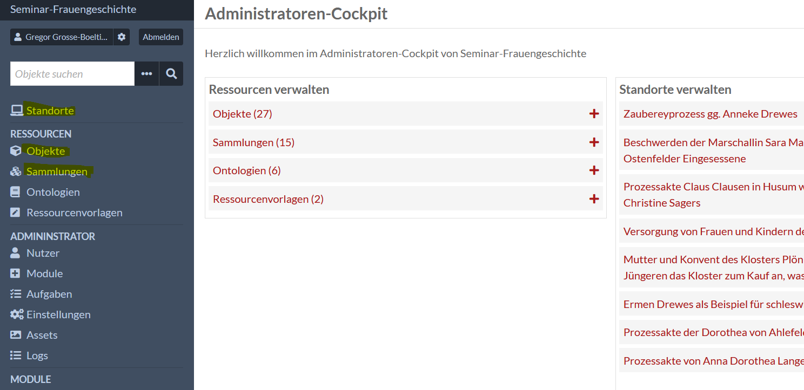

#### Objekte (Items) und Sammlungen (Item Sets)

Das Arbeiten mit Objekten und Sammlungen verläuft sehr ähnlich: Legen Sie zunächst eine Sammlung für Ihre Manuskripte an und geben Sie der Sammlung einen sprechenden Namen. Wählen Sie unter "Ressourcenvorlage" *Frauengeschichte* aus. Anschließend sollten Sie die Felder des Formulars entsprechend der Vorgaben von [METAscripta](https://metascripta.org/standards) pflegen.

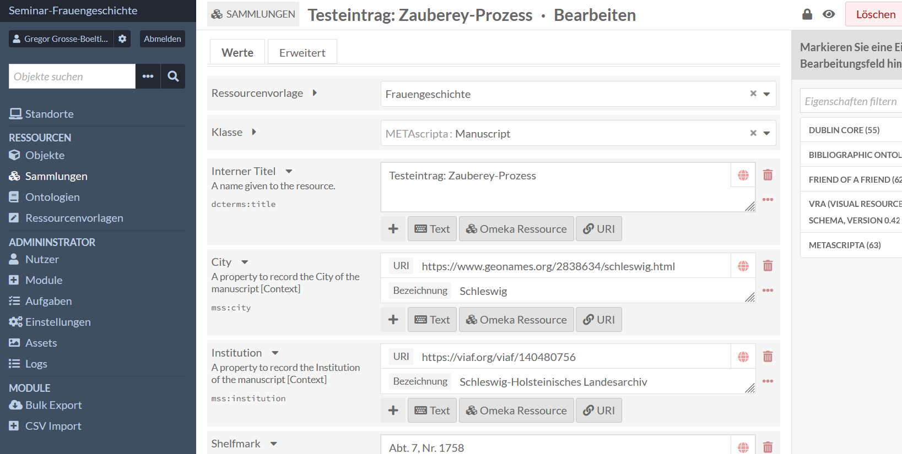

Achten Sie darauf die Autoritäten und Vokabulare korrekt anzugeben. Wenn bspw. ein [GeoNames-Eintrag](https://www.geonames.org) gefordert ist, sollten Sie wie folgt vorgehen: Besuchen Sie die Seite der Autorität (GeoNames) und suchen Sie den gewünschten Eintrag (bspw. *Schleswig*) heraus. Unterhalb des Schema-Feldes (im Beispiel *City*) klicken Sie auf **URI** und geben als Link den aus der Browserzeile (oder von der Website kopierten) Link der Ressource an. Geben Sie unter Bezeichnung einen sprechenden, möglichst kanonischen Namen an. Sie können sich für das Vorgehen gerne an der Test-Sammlung orientieren und von dort die auch für Sie passenden Einträge kopieren. 

Bearbeiten Sie in der Sammlung alle Felder, die für alle ihre Dokumente gleich sind.

Anschließend legen Sie für jede Manuskriptseite ein Objekt an: Auch hier ist zunächst als Ressourcenvorlage *Frauengeschichte* auszuwählen. Tragen Sie hier nur noch die Dinge ein, die von der Sammlung abweichen bzw. nicht für alle Dokumente der Sammlung gleich sind (und entsprechend in der Sammlung nicht auftauchen). Das betrifft bspw. die Transkription (im Schema-Feld *Explizit*).

Weiterhin sollten Sie für jedes Objekt das Digitalisat (sprich das Foto der Manuskriptseite) hochladen. Dies ist über den Reiter **Medien** möglich. Jedes Objekt müssen Sie anschließend zudem noch Ihrer zuvor erstellten Sammlung hinzufügen. Das ist über den Reiter **Sammlungen** möglich. 

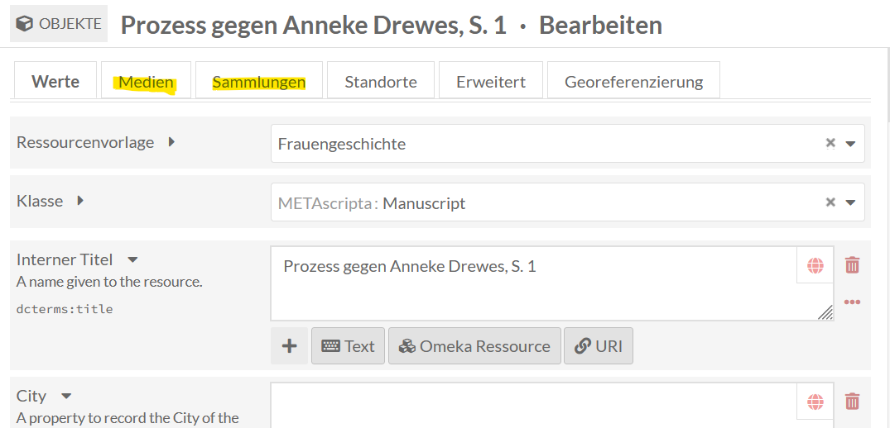

#### Standorte (Website)

Sobald Sie eine Sammlung und (mindestens eine handvoll Objekte) erstellt haben, können Sie eine Website (verwirrenderweise *Standort* in Omeka genannt) erstellen. Geben Sie ihrer Website einen deskriptiven Namen. 

Damit Ihre Objekte korrekt auf Ihrer Website angezeigt werden, sind zwei zusätzliche Schritte notwendig:

1. Klicken Sie für Ihre Website auf den Menüpunkt *Standortadministrator* und dann auf den Reiter *Einstellungen*. Entfernen Sie den Haken (falls gesetzt) bei **Auto-assign new items**.
2. Fügen Sie ihre Objekte zu ihrer Website hinzu: Das ist bei den Einstellungen der Objekte möglich, in dem Sie auf den Reiter *Standort* wechseln (befindet sich neben Medien und Sammlungen, s.o.) und dort ihre Website auf der rechten Seite auswählen.

Anschließend können Sie eine einzelne Seite für ihre Reflexion erstellen. Mit HTML-Blöcken können Sie auf Ihrer Website Texte zur Verfügung stellen. Orientieren Sie sich auch hierzu gerne an der Beispiel-Seite und beachten Sie die weiter oben verlinkten Tutorials.

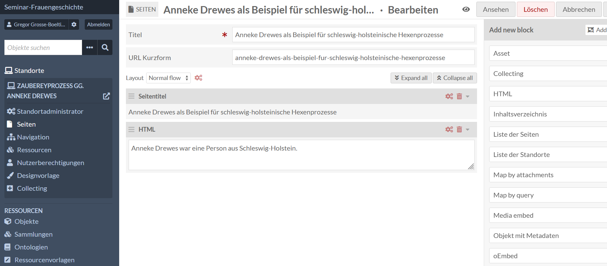

#### Ich komme nicht weiter, was soll ich tun?

Schreiben Sie mir (Gregor Große-Bölting) eine E-Mail  mit einer kurzen Problembeschreibung!

## Sitzung am 11.07.
