<!--

author: Swantje Piotrowski, Gregor Große-Bölting
email:  ggb@informatik.uni-kiel.de
version: 0.1
language: en
narrator: UK English Female

-->

# Projektseminar zur Geschichte der Neuzeit: Frauengeschichte(n) in der Frühen Neuzeit digital erschließen.

**Dozierende:**

* Dr. Swantje Piotrowski, M.A.
* Dr. Gregor Große-Bölting, M.A., M.A.

**Zeit und Raum:** Do 10:15 - 11:45, Raum LS 11-R. 109

**Inhalt:**

Über das Leben und Wirken von Frauen im öffentlichen Raum im 17. und 18. Jahrhundert ist wenig bekannt. Im Gegensatz zu den Männern hinterließen sie nur selten Spuren in historischen Überlieferungen. Im Universitäts- und Landesarchiv in Schleswig befinden sich jedoch Quellen, die bislang in Hinblick auf Frauen- und Geschlechterforschung noch nicht ausgewertet wurden. In dieser forschungsorientierten Lehrveranstaltung sammeln, strukturieren und interpretieren Studierende Informationen aus historischen Quellen (z.B. Frauenbiographien), um Einblicke in soziale und familiäre Netzwerke, in karikative Tätigkeiten und den Bildungsstand von Frauen in der Frühen Neuzeit zu erhalten. Die Lehrveranstaltung hat das Format einer (digitalen) Forschungswerkstatt: Der Arbeitsablauf wird Schritt für Schritt entwickelt, umgesetzt und diskutiert. Durch die Forschungspraxis werden Studierende mit digitalen Grundkenntnissen sowie mit gängigen Methoden für die digitale Bearbeitung und Auswertung von handschriftlichen Quellen vertraut gemacht. Die Lehrveranstaltung bildet so eine solide Grundlage für die kritische Anwendung solcher Verfahren im weiteren Studium und in wissensvermittelnden Berufsfeldern. Als Prüfungsleistung gilt die Erstellung eines Reflexionsberichts über den Arbeits- und Forschungsprozess sowie die Visualisierung der Rechercheleistung.

**Lernziele:**

* Transkription von handschriftlichen und gedruckten Dokumenten
* fachwissenschaftliche Einordnung der Quellen
* vertiefte fachwissenschaftliche Kenntnisse (Frauen- und Geschlechtergeschichte, Biographiegeschichte, Public History, Sammlungsgeschichte)
* Methodenkompetenz im Bereich der Digital Humanities
* Visualisierung und Präsentation der Forschungsergebnisse
* Erfahrungen in den Berufs- und Praxisfeldern Wissensvermittlung
* eigenständiges und selbstorganisiertes Arbeiten

**Weiterführende Links und Literatur:**

* Artikel zur Geschlchtergeschichte: https://docupedia.de/zg/Geschlechtergeschichte
* Link zum **DDF:** https://www.digitales-deutsches-frauenarchiv.de
* Link zum **akhfg:** https://akhfg.de
* Link zum **Center for the History of Women Philosophers and Scientists**: https://historyofwomenphilosophers.org/

## Allgemeines und erste Sitzung

### Semesterplan

**Termine:**

| Datum | Thema/Inhalt |
|-------|--------------|
| 18.04. | Begrüßung, Organisatorisches, Erwartungen, Fragen |
| 25.04. | Inhaltliche Einführung in den Themenbereich "Frauen- und Geschlechtergeschichte" |
| 02.05. | Frühe Neuzeit als Epoche / Anfänge und Entwicklungen der Geschlechtergeschichte / Potentiale und Kritik / Diskussion von potenziellen Forschungsthemen |
| 09.05. | Feiertag CHRISTI HIMMELFAHRT |
| 16.05. | Einführung in verschiedene Quellenarten zur Erforschung von Frauenbiographien / Arbeit mit ungedruckten Quellen und Handschriften / Transkribus /  Archivinformationssystem Arcinsys |
| 23.05. | Digitaliserung von Quellen, Arbeit mit Digitalisaten und Forschungsdaten (m. B. Petersen) |
| 30.05. | Besuch im Landesarchiv (mit dem Leiter des Universitätarchivs Dr. Jörg Rathjen) |
| 06.06. | gemeinsame Arbeitssitzung / Analyse der gesammelten Quellen/ |
| 13.06. | Entwicklung von Forschungsfragen / Beispiele für Online-Präsentationen / Präsentation der Quellen |
| 20.06. | Metadatenstandards: Welche gibt es und ihr Sinn und Zweck / Anwendung auf Forschungsergebnisse |
| 27.06. | Omeka S und "How to" zur Präsentation der Quellen |
| 04.07. | gemeinsame Arbeitssitzung / Recherche / Feedback und Beratung zur Weiterentwicklung der Forschungsprojekte |
| 11.07. | Präsentation der (Zwischen-)Ergebnisse, Evaluation |

#### ScanTent

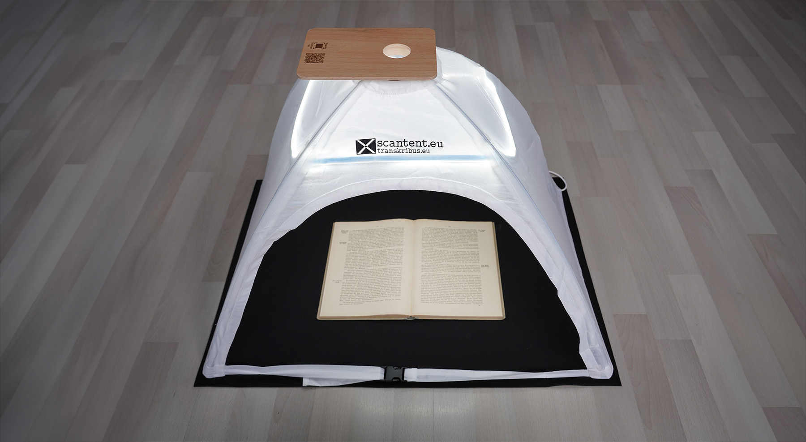

#### Transkribus

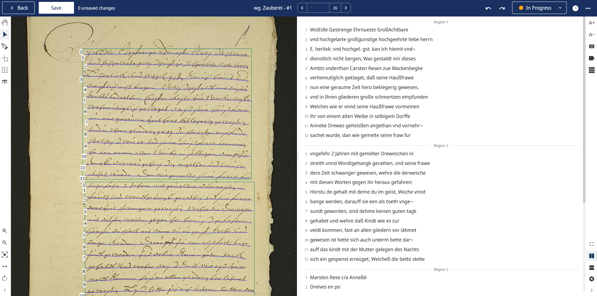

#### Omeka

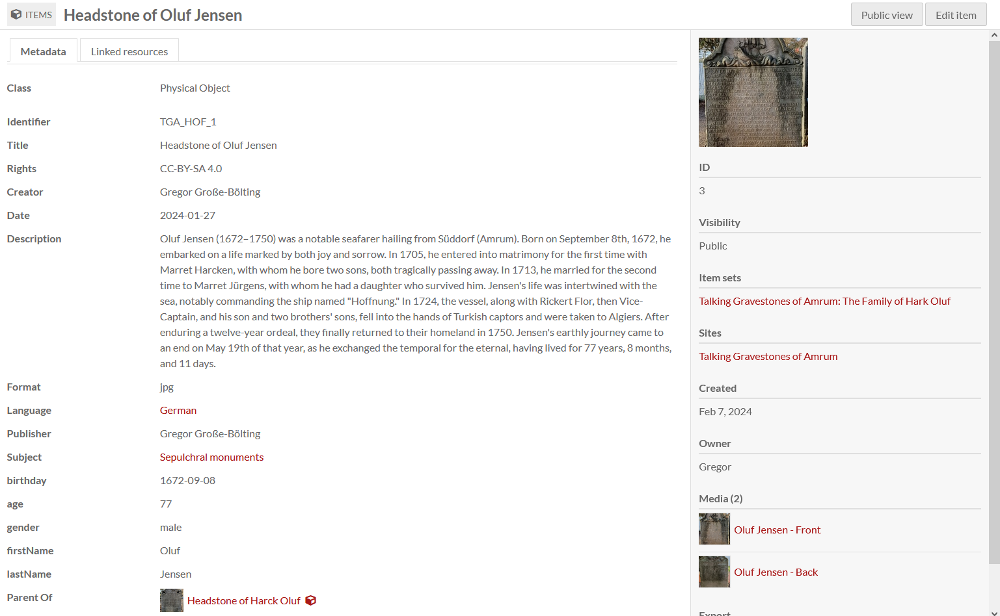

### Prüfungsleistung

Produkt zur Darstellung der ausgewählten Quellen inkl. Reflexion zur frauengeschichtlichen Bedeutung.

Details folgen im Laufe des Semesters.

### "Regierungserklärung"

1. Diese Veranstaltung ist eine Forschungswerkstatt: Wir setzen neue Methoden und Software ein. Seien Sie also nachsichtig mit uns und mit sich selbst, wenn mal etwas nicht funktioniert wie geplant. Lassen Sie uns zeitnah wissen, wenn Sie Probleme haben, dann findet sich für alles eine Lösung!
2. Weil es sich um eine Forschungswerkstatt handelt, erwarten wir Eigenengagement und Eigeninitiative für das Thema: Sie werden an verschiedenen Stellen selbst recherchieren, arbeiten und experementieren müssen. Im Gegenzug unterstützen wir Sie, wo wir können.
3. Es kann sein, dass Sie in Ihren Quellen wenig oder gar keine biographischen Details finden: Das ist auch ein Ergebnis, dessen Dokumentation einen Wert hat!
4. Der Seminarplan ist "im Fluss".

### Gruppenarbeit Mind-Map

1. Bilden Sie Gruppen von 3 bis 4 Teilnhemenden.
2. Jede Gruppe wählt ein Hauptthema aus dem Bereich der Frauen- und Geschlechterforschung in der Frühen Neuzeit, z.B. Frauen in der Wissenschaft, Frauen und Religion, Frauen und Bildung, etc.
3. Erstelln Sie eine Mind-Map: Diese sollte die folgende Elemente enthalten:

   * Hauptthema (z.B. Frauen in der Wissenschaft)
   * Unterkategorien oder Aspekte des Themas (z.B. berühmte Wissenschaftlerinnen, Zugang von Frauen zur Bildung, Herausforderungen für Frauen in der akademischen Welt, etc.)
   * Schlüsselbegriffe, Personen, Ereignisse oder Quellen, die mit den Unterkategorien verbunden sind
   * Präsentation: Jede Gruppe präsentiert ihre interaktive Mind-Map und erläutert kurz die ausgewählten Themen.

### Aufgabe zur nächsten Woche

Bitte lesen Sie zur nächsten Woche den folgenden Artikel:

* Leonie Schöler: Beklaute Frauen: Denkerinnen, Forscherinnen, Pionierinnen: Die unsichtbaren Heldinnen der Geschichte. München 2024, Einleitung, S. 11-23 (im Olat-Ordner).

Desweiteren können Sie optional und zur weiteren Vertiefung den folgenden Artikel lesen:

* [Kirsten Heinsohn](https://docupedia.de/zg/Docupedia:Kirsten_Heinsohn "Docupedia:Kirsten Heinsohn"), [Claudia Kemper](https://docupedia.de/zg/Docupedia:Claudia_Kemper "Docupedia:Claudia Kemper"), Geschlechtergeschichte, in: Docupedia-Zeitgeschichte, 04.12.2012, [http://docupedia.de/zg/heinsohn_kemper_geschlechtergeschichte_v1_de_2012](https://docupedia.de/zg/Docupedia:Kirsten_Heinsohn)

## Sitzung am 25.04.2024

### Gruppenarbeit Mind-Map

1. Bilden Sie Gruppen von 3 bis 4 Teilnehmenden.
2. Jede Gruppe wählt ein Hauptthema aus dem Bereich der Frauen- und Geschlechterforschung, z.B. Frauen in der Wissenschaft, Frauen und Religion, Frauen und Bildung, etc.
3. Erstellen Sie eine Mind-Map. Diese sollte die folgende Elemente enthalten:

   * Hauptthema (z.B. Frauen in der Wissenschaft)
   * Unterkategorien oder Aspekte des Themas (z.B. berühmte Wissenschaftlerinnen, Zugang von Frauen zur Bildung, Herausforderungen für Frauen in der akademischen Welt, etc.)
   * Schlüsselbegriffe, Personen, Ereignisse oder Quellen, die mit den Unterkategorien verbunden sind

4. Jede Gruppe präsentiert ihre Mind-Map und erläutert kurz die ausgewählten Themen.

#### Ergebnisse: Gruppe "Bildung"

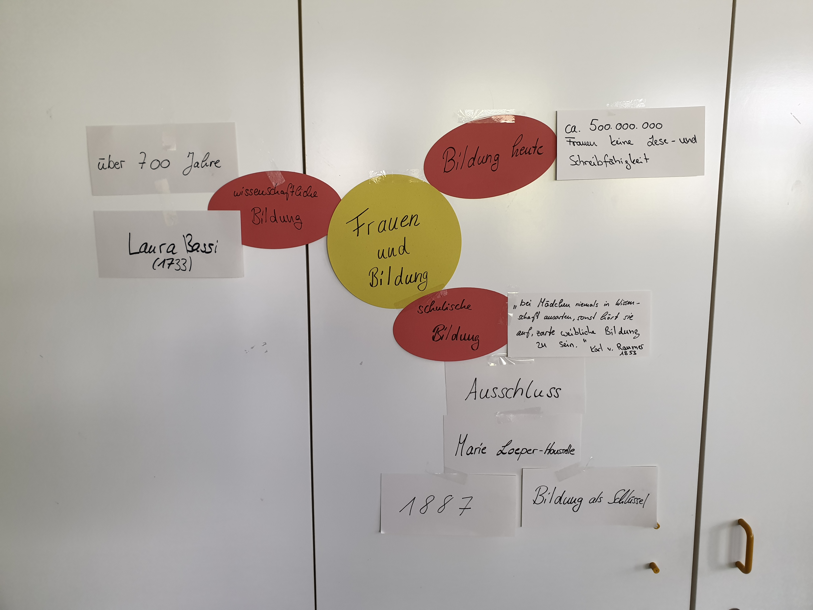

#### Ergebnisse: Gruppe "Macht"

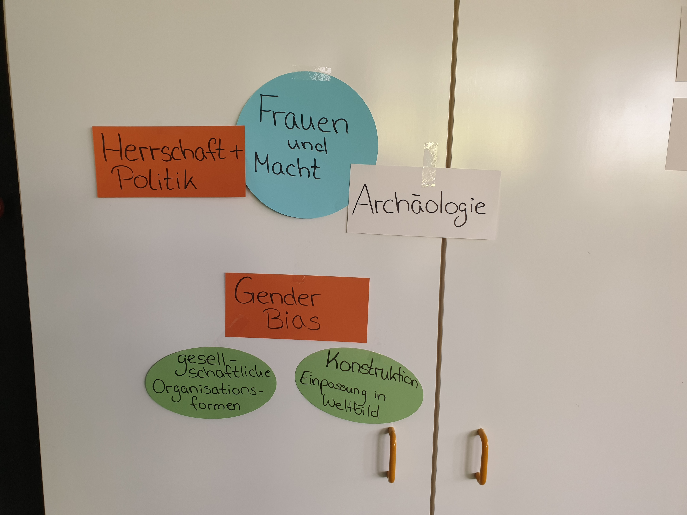

#### Ergebnisse: Gruppe "Religion"

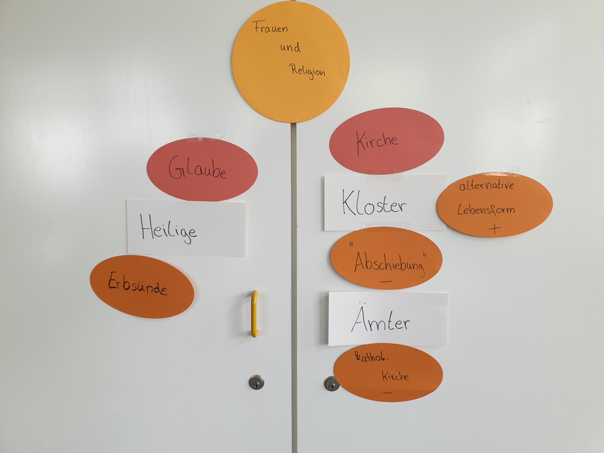

#### Ergebnisse: Gruppe "Wissenschaft"

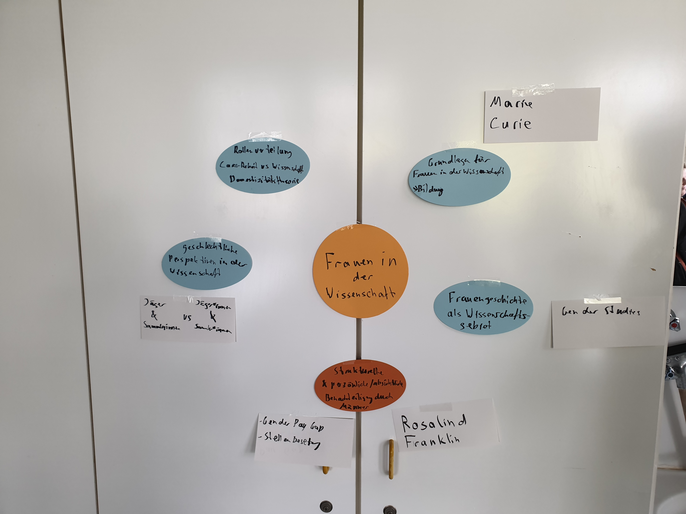

#### Ergebnisse: Gruppe "Politik"

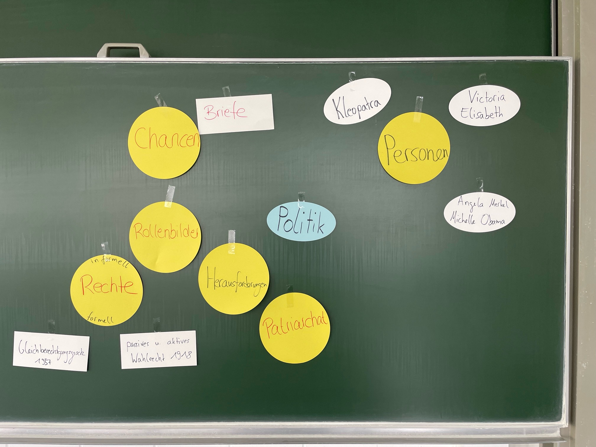

### Aktuelle Debatten um Stereotypen

> Sind diese Geschlechterstereotype aktuell überwunden? Was meinen Sie?

{{1}}
> _Die bereits erwähnten Stereotypen und bestehenden Vorurteile gegenüber Frauen sind weiterhin präsent, wie eine aktuelle Untersuchung zur "Darstellung von Geschlechterrollen in sozialen Medien und deren Einfluss auf die Geschlechtergerechtigkeit" verdeutlicht:_

{{2}}
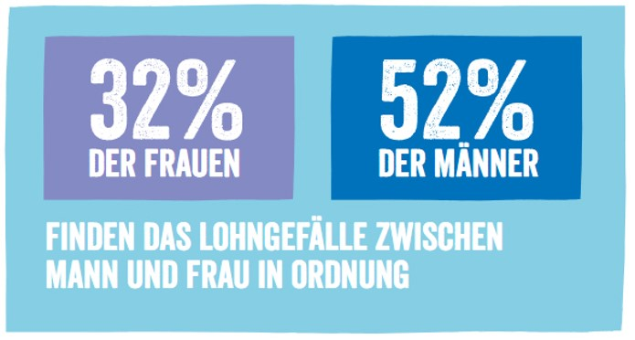

{{3}}
********
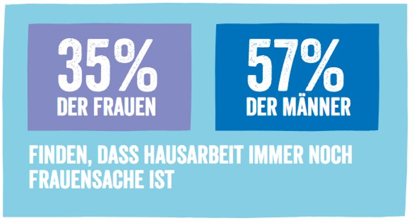

Quelle: [https://www.plan.de/rollenbilder-in-social-media.html?sc=IDQ24200](https://www.plan.de/rollenbilder-in-social-media.html?sc=IDQ24200)
********

### Aufgabe zur nächsten Woche

Bitte lesen Sie zur nächsten Woche den folgende Artikel:

* Geschlechterrollen in der Frühen Neuzeit: https://referenceworks.brill.com/display/entries/EDNO/COM-272465.xml

* Epochenbegriff Frühe Neuzeit: https://referenceworks.brill.com/display/entries/EDNO/COM-267907.xml#d39764389e786

* Natalie Zemon Davis, Neue Perspektiven für die Geschlechterforschung in der Frühen Neuzeit; im Olat-Ordner

## Sitzung am 02.05.2024

### Leichenpredigt Katharina Franck (1698)

Die vollständige Leichenpredigt finden Sie im OLAT.

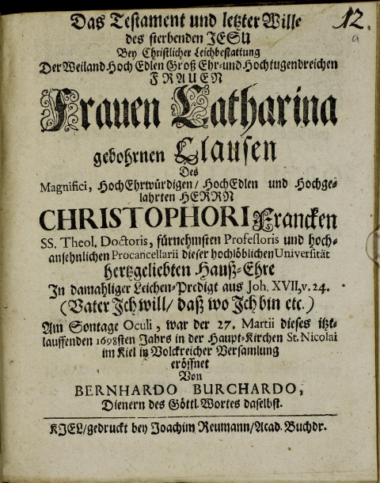

**Titel:** Das Testament und letzter Wille des sterbenden Jesu

**Untertitel:** Bey Christlicher Leichbestattung Der Weiland Hoch Edlen Groß Ehr- und Hochtugendreichen Frauen Frauen
Catharina gebohrnen Clausen Des Magnifici, HochEhrwürdigen/ HochEdlen und Hochgelahrten Herrn Christophori Francken
SS. Theol. Doctoris, fürnehmsten Professoris und hochansehnlichen Procancellarii dieser hochlöblichen Universität
hertzgeliebten Hauß-Ehre In damahliger Leichen-Predigt aus Joh. XVII, v. 24. (Vater Ich will/ daß wo Ich bin etc.) Am Sontage
Oculi, war der 27. Martii dieses itztlauffenden 1698sten Jahrs in der Haupt-Kirchen St. Nicolai im Kiel in Volckreicher
Versamlung eröffnet.

#### Personalia

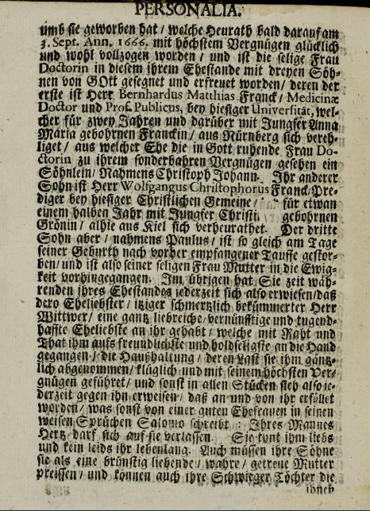

Finden Sie an der Leichenpredigt etwas überraschend? Wenn ja was?

#### Frauengeschichtliche Interpretation

Welche Textstellen aus dem Abschnitt zu den "Personalia" würden Sie als Beschreibung typisch weiblicher Merkmale kennzeichnen?

### Inkshedding: Themenfindung

1. Falten Sie ein DIN A4-Blatt vertikal in der Mitte. Vervollständigen Sie auf der linken Seite des Knicks den nachfolgenden Satz. Nutzen Sie die komplette linke Seite und schreiben Sie möglichst leserlich! Sie haben 10 Minuten Zeit.

> Der Aspekt … interessiert mich besonders an der Frauengeschichte der Frühen Neuzeit, weil …

1. Anschließend werden alle Zettel eingesammelt, gemischt und erneut ausgeteilt. Lesen Sie den (hoffentlich fremden) Text, markieren und kommentieren Sie die Punkte, die Ihnen besonders gut gefallen und spannend sind. Achten Sie auf interessante Inhalte und kommentieren Sie bitte immer positiv, etwa so: „Großartige Idee! Dazu fällt mir auch ein, dass …“. Dazu stehen 5 Minuten zur Verfügung.
2. Wir wiederholen 2. ein zweites Mal.

### Aufgabe zur nächsten Woche

1. Melden Sie sich beim [Archivinformationssystem Schleswig-Holstein](https://arcinsys.schleswig-holstein.de) an und machen Sie sich mit der Suche und der Struktur der Gliederung der Akten vertraut.
2. Versuchen Sie sich an der Transkription der folgenden Handschriftseite aus einem Zauberey-Prozess:

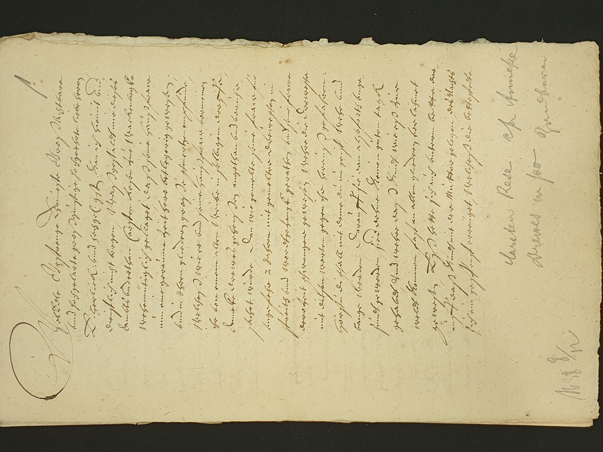

## Sitzung am 09.05.

Entfällt wg. Feiertag!

